# Azure IoT Edge Containarization

## Configuration

### Step 1 - Create a new Hub, Resource and Device

Before we can start deploying module to our edge device we need to do some configuration on the Azure Portal.

To start we are going to create a Edge IoT Hub, a Resource group, and save the connection strings needed to access remotly these resources.

On the Azure Portal, we are going to select IoT Hub.

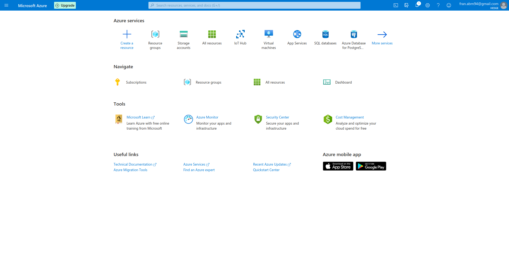

This will lead us to this page:

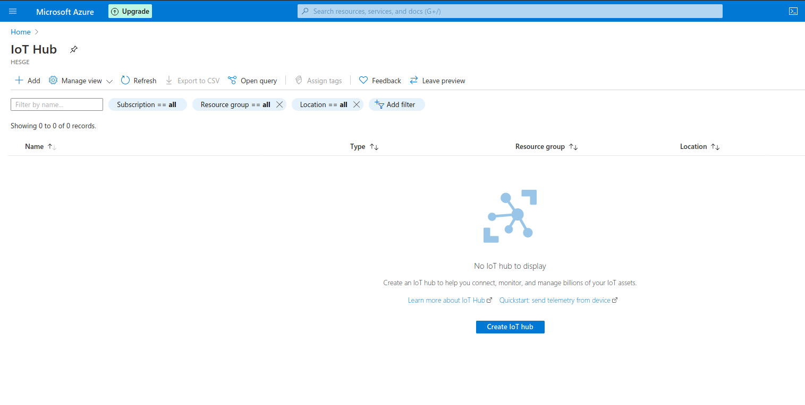

Click on Add

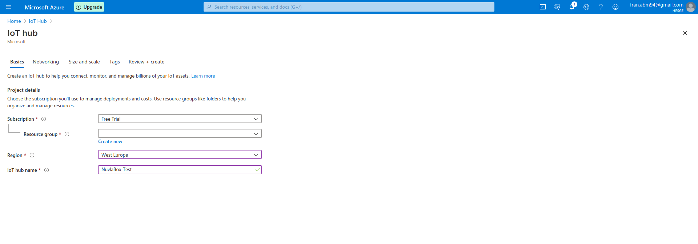

On this form, we need to select the subscription, the resource group, the Region, and the name of the IoT Hub. Because we haven't created a resource group, we are going to click on *create new*, bellow the resource group selection box.

This will launch the following modal:

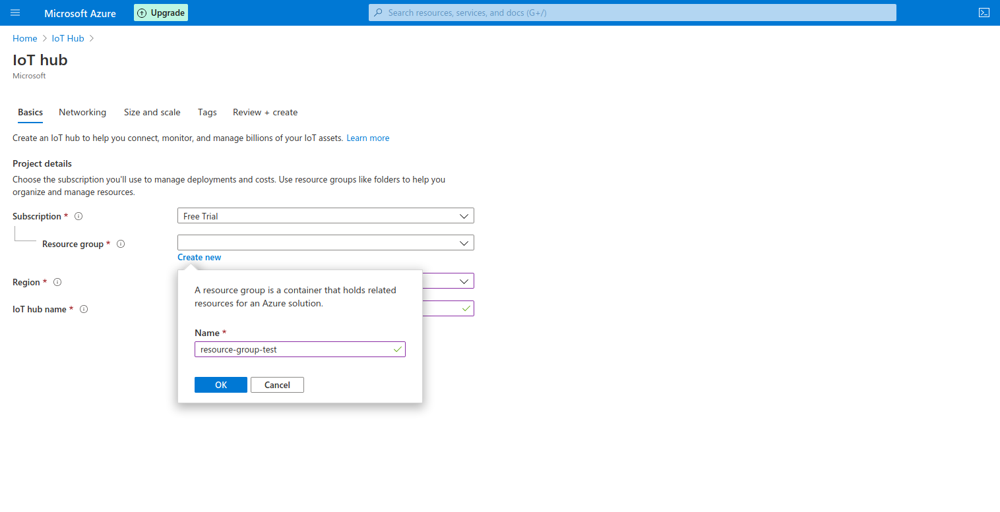

Chose a name for the resource group, and then a name for the IoT Hub.

For this tutorial we don't care about the next configuration option, so we will click on **Review and Create** on the bottom left corner.

After a few seconds, the IoT Hub and the Resource Group should be created.

Your IoT Hub page should look something like this:

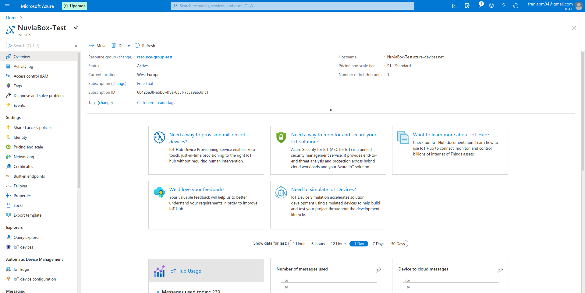

In the middle we can see some details from the IoT Hub that we will need later/

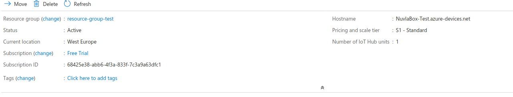

We will need the current location (RG_LOCATION), subscription ID (THE_SUBSCRIPTION_ID), Pricing and scale Tier (IoT_SKU) and the IoT Hub Name.
Also, remeber the resource group's name.

Now, we are going to create a IoT Device on the Azure Portal. This is a virtual copy of your Edge device.

On the side menu, scroll down until we see IoT Edge on the Automatic Device Management section

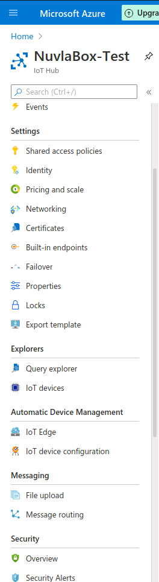

Click on it, and a page like this should appear:

We are going to click on Add an IoT Edge Device. The following page should appear:

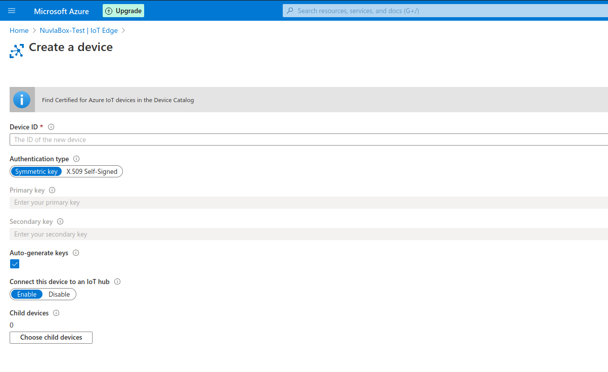

We are going to fill in the box for the device ID. Everything else, we can leave as default. Click on Save. Now, the IoT Edge Page should have one device:

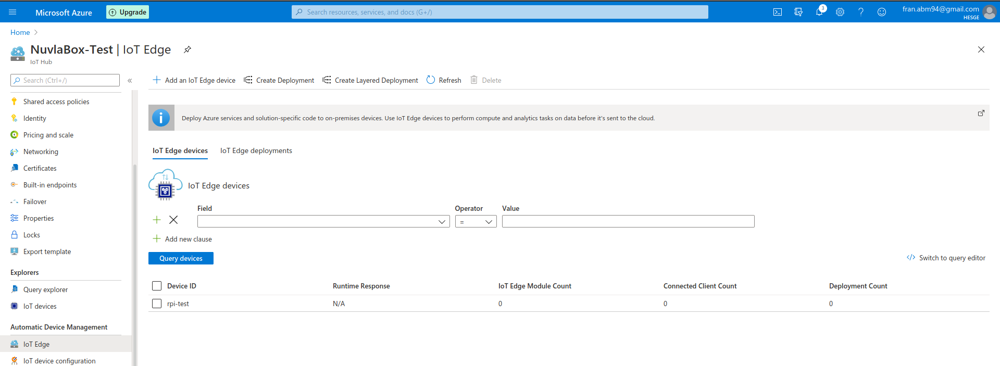

Now we can go to Nuvla and check what we need to deploy the Azure IoT Edge Runtime.

After login in to Nuvla go to Apps.

Search for *Azure Iot Edge Runtime*. Click on it (not on launch), to see the configuration.
Scroll down to the Environmental Variables section

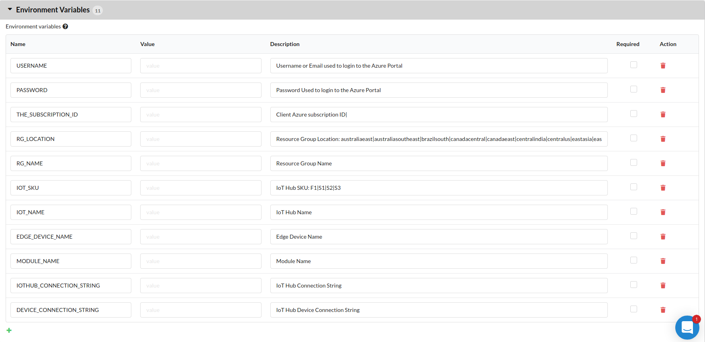

There are quite a lot of variables to be defined. Let's start from the top.

USERNAME is the username or password we use to login to Azure.

PASSWORD is the password used to login to Azure

THE_SUBSCRIPTION_ID is on IoT Hub Details.

RG_LOCATIION is also on the IoT Hub Details. Note: it needs to be all in lowercase and without spaces. You can see the options on the description of the Env. Variables.

RG_NAME is the name we gave to our resource group

IOT_SKU is also defined on thee IoT Hub Details.

IOT_NAME is the name we gave to the IoT Hub, and can also be found on the IoT Hub's Details.

EDGE_DEVICE_NAME is the name we gave to our Edge device

IOTHUB_CONNECTION STRING and DEVICE_CONNECTION_STRING. These two environmental variables are retrieved from the Azure Cloud Shell. We can access the Web Terminal by pressing the following button on the top right corner of our page:

After a few second a Cloud Shell Will be available to be used. To check the two string, we need two commands.

For the IOT_CONNECTION_STRING:

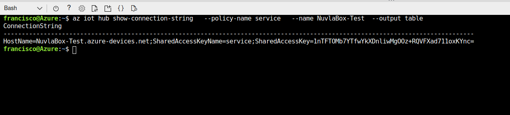

We need to change what is after the *--name*, to the name of our IoT Hub

For the DEVICE_CONNECTION_STRING:

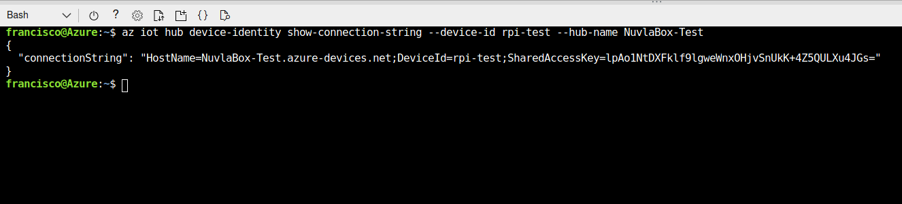

In this case we need to change two things: what is after *--device-id*, for the name of the Edge device we created, and what is after *--name* for the name of the IoT Hub.

After copying the two string everything we need to deploy is done.

### Step 2 - Deployment

Now we can go back to Nuvla and go to the Apps. Let's search again for the Azure IoT Edge Runtime and lets click on launch

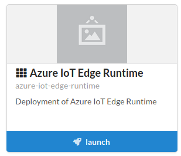

Something like this should appear:

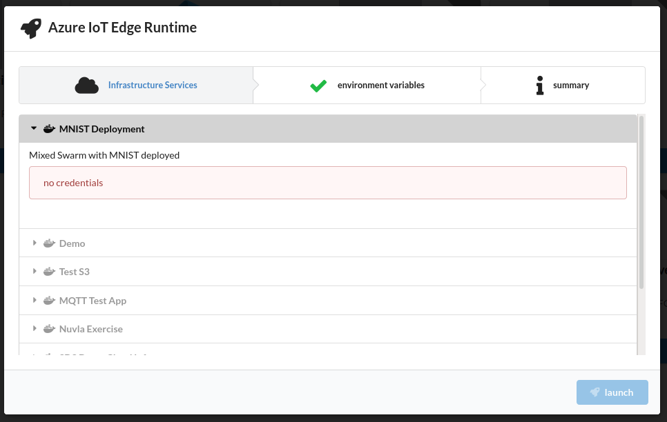

On the Environmental Variables tab input the string we've been collecting.

Press launch

### Step 3 - Login

One problem with this solution is the need to login to Azure, from a secure Azure interface. As such the first step in our deployment is the login.

After deploying the application, go into the logs. The first log there should be a 

