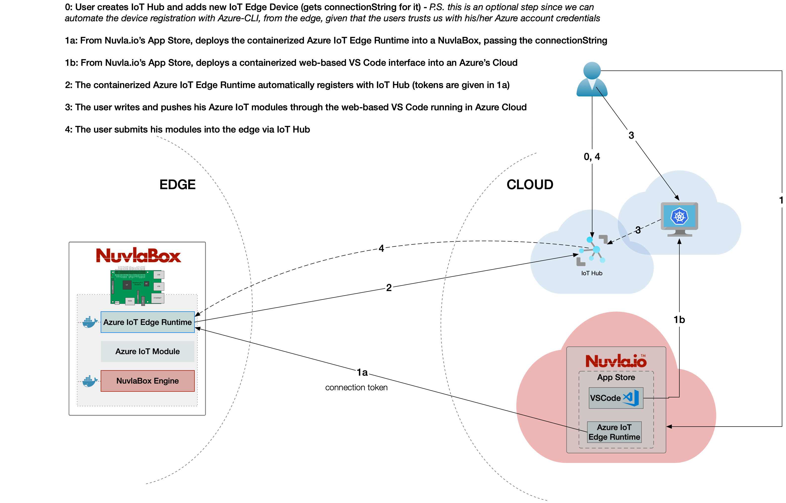

# Azure IoT Edge setup via Nuvla.io: with no host dependencies

This troubleshooting report documents the steps necessary to reproduce a full Azure IoT Edge setup which can be performed from Nuvla.io.

**NOTE: for this scenario, we are not relying on any pre-existing software from the host (like the `iotedge` or `azure-cli` tools).**

## References

 - Nuvla.io: [https://nuvla.io](https://nuvla.io)
 - Azure IoT Edge docs: [https://docs.microsoft.com/en-us/azure/iot-edge/quickstart-linux](https://docs.microsoft.com/en-us/azure/iot-edge/quickstart-linux) and [https://docs.microsoft.com/en-us/azure/iot-edge/how-to-install-iot-edge-linux](https://docs.microsoft.com/en-us/azure/iot-edge/how-to-install-iot-edge-linux)
 - Source code for this integration: [https://github.com/SixSq/azure-iot-edge-runtime-container/tree/dind](https://github.com/SixSq/azure-iot-edge-runtime-container/tree/dind)

## Integration architecture

**NOTE:** this document does not address points 1b nor 3 from the architecture
 
## Procedure to reproduce scenario

Nuvla.io provides container application management for the cloud and edge. Thus, all the integration work hereafter involves the containerization of all Azure IoT Edge setup instructions.

With basis on the integration architecture depicted above, here are the steps to be taken in order to reproduce the current integration status:

**Step by step**

---

 1. prepare a Docker Image with all the necessary Azure IoT tools inside and `iotedge` set as the entrypoint

 	 - the `iotedge` client has been designed to run as a systemd service. To speed up the integration tests, we've built a Docker Image with systemd installed, even though this is ultimately not the desired setup (_see remark 1.1_)
 	 - for compatibility reasons, this Docker Image is only built for `x86_64` architectures (_see issue 1.2_). Ideally, we'd need to have this for other architectures as well

 	 
 	  	 
 	 _Azure IoT Edge Runtime Dockerfile ([https://github.com/SixSq/azure-iot-edge-runtime-container/blob/dind/Dockerfile](https://github.com/SixSq/azure-iot-edge-runtime-container/blob/dind/Dockerfile))_:
 	 
	 	 	FROM jrei/systemd-ubuntu:18.04
	
			RUN apt update && apt install -y curl lsb-release gnupg jq net-tools
			
			RUN curl https://packages.microsoft.com/config/ubuntu/18.04/multiarch/prod.list > /etc/apt/sources.list.d/microsoft-prod.list
			
			RUN curl https://packages.microsoft.com/keys/microsoft.asc | gpg --dearmor > /etc/apt/trusted.gpg.d/microsoft.gpg
			
			RUN echo “deb [arch=amd64] https://packages.microsoft.com/repos/azure-cli/ $(lsb_release -cs) main” | \
			          tee /etc/apt/sources.list.d/azure-cli.list
			
			RUN apt update && apt install -y moby-engine && \
			      apt install -y iotedge azure-cli && \
			      systemctl enable iotedge && \
			      apt autoclean && rm -rf /var/lib/apt/lists/*
			
			RUN az extension add --name azure-iot
			
			VOLUME /var/lib/docker

		
 2. since the Azure IoT Edge Runtime container has systemd as PID 1, we cannot define a custom entrypoint for the automation script (_see remark 2.1_). For now, we are defining a sidecar container just for running this automation script. This script could also be added as yet another systemd service to avoid having a 2nd container. The result would be the same. 

 	 _Sidecar Dockerfile ([https://github.com/SixSq/azure-iot-edge-runtime-container/blob/dind/Dockerfile.sidecar](https://github.com/SixSq/azure-iot-edge-runtime-container/blob/dind/Dockerfile.sidecar))_:
 	 
 	 	FROM docker

		RUN apk add bash jq
		
		COPY entrypoint.sh /
		
		RUN chmod +x entrypoint.sh
		
		ENTRYPOINT [“bash”, “entrypoint.sh”]

 3. the automation script can be found at [https://github.com/SixSq/azure-iot-edge-runtime-container/blob/dind/entrypoint.sh](https://github.com/SixSq/azure-iot-edge-runtime-container/blob/dind/entrypoint.sh). It considers the following environment variables (provided from Nuvla.io) as inputs for execution:

   - **TENANT_URL**, **TENANT_PASSWORD**, **TENANT_ID**, **AZURE_USERNAME** , **AZURE_PASSWORD**: if provided (with the right combination, i.e. all TENANT\_* **or** all AZURE\_*), the script signs in with Azure, using the `az` CLI
   - **AZURE\_IOT\_HUB\_NAME**: if provided, together with the `az` login environment variables, the script self-registers the underlying device as a new edge device in Azure IoT Hub
   - **CONNECTION_STRING**: if provided, the script ignores the `az` login and configures only the `iotedge` client

 4. to deploy these two containers, we use Docker Compose or a Docker Swarm Stack. The Compose file (which defined the app in Nuvla.io) is ([https://github.com/SixSq/azure-iot-edge-runtime-container/blob/dind/docker-compose.yaml](https://github.com/SixSq/azure-iot-edge-runtime-container/blob/dind/docker-compose.yaml)):
 
		version: '3.6'
		services:
		
		  azure-iot-edge:
		    image: 'franciscomendonca/azure-runtime:1.0'
		    container_name: 'azure-iot-edge'
		    privileged: true
		    volumes: 
		      - '/sys/fs/cgroup:/sys/fs/cgroup:ro'
		
		
		  sidecar:
		    image: franciscomendonca/azure-sidecar:1.0
		    container_name: 'azure-sidecar'
		    network_mode: 'host'
		    volumes:
		      - '/var/run/docker.sock:/var/run/docker.sock'
		    environment:
		      - TENANT_URL=
		      - TENANT_PASSWORD=
		      - TENANT_ID=
		      - AZURE_IOT_HUB_NAME=
		      - AZURE_USERNAME=
		      - AZURE_PASSWORD=
		      - CONNECTION_STRING=

 	 
	Since the `iotedge` and all Azure IoT Modules rely on the `unix:///var/run/iotedge/mgmt.sock` and `unix:///var/run/iotedge/workload.sock` sockets, we had 2 options: 
	1. share the host’s socket with the container, and add another bind mount for `/var/run/docker.sock`, in such a way that the forthcoming modules run at the host level (no `dind` required) - preferred scenario, or
	2. keep everything self-container, including the `docker` and `iotedge` sockets. 

	Option 1. is problematic if the host doesn’t already have an `iotedge` client installed (_see remark 4.1_).
	
	So this demonstration is using option 2., which means all forthcoming Azure IoT Modules will run inside the Azure IoT Runtime container (_see **critical** issue 4.2_) - thus the `network_mode: host`.
   
 5. this stack can be deployed either manually, via `docker-compose up` or `docker stack up --compose-file docker-compose.yaml sixsq-azure-iot-integration`, or via Nuvla.io. 

  
# Summary of issues/remarks

_NOTE: the number assigned to each issue/remark is respective to the step number in the procedure above. Example: issue 2.1 is the first issue encountered in step 2 above, whilst issue 4.2 is the second issue encountered in step 3_

#### #1

1.1: troubles running `iotedged` from inside the container, without systemd installed 

1.2: `azure-cli` is not available for `arm64`
 
#### #2

2.1: running `iotedge` with systemd from within a container makes it hard to retrieve the application logs directly from Docker, with `docker logs`

#### #4

4.1: sharing the `iotedge` sockets with the host is unreliable because if they don’t yet exist on the host, given that a socket is not a regular file, Docker’s bind mount will make them look like a folder at the host level, and the future Azure IoT Modules running on the host won’t be able to communicate through it

4.2: (**critical**) when running Docker in Docker, the host’s Docker socket is not being shared, which means all the Azure IoT Modules (including the `edgeagent`) will run inside a container. It becomes a nested container architecture which will present problems at the level of: security, giving Azure IoT Modules access to the host filesystem and IoT peripherals, capabilities, networking, and others. Even though such model is functional for minimalistic use cases, it is not appropriate for production and thus not suitable as a minimal marketable product for the integration of Azure IoT Edge with Nuvla.io

## TODO

The end goal is to have an MMP that can be given to both Azure and SixSq users, providing an automated integration between the two. To accomplish that, we would need to **at least** come up with a solution for issue 4.2.
